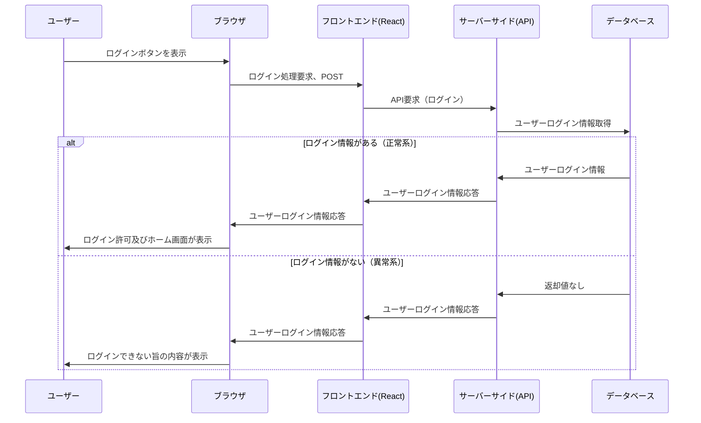
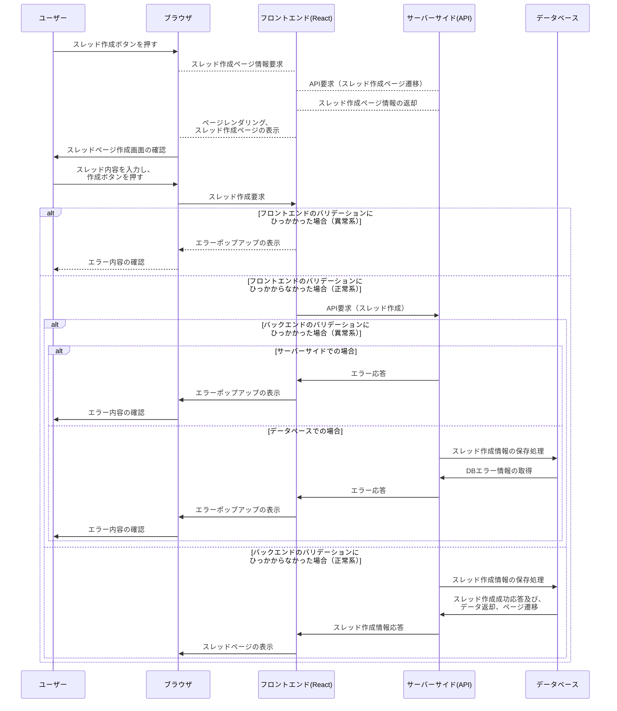
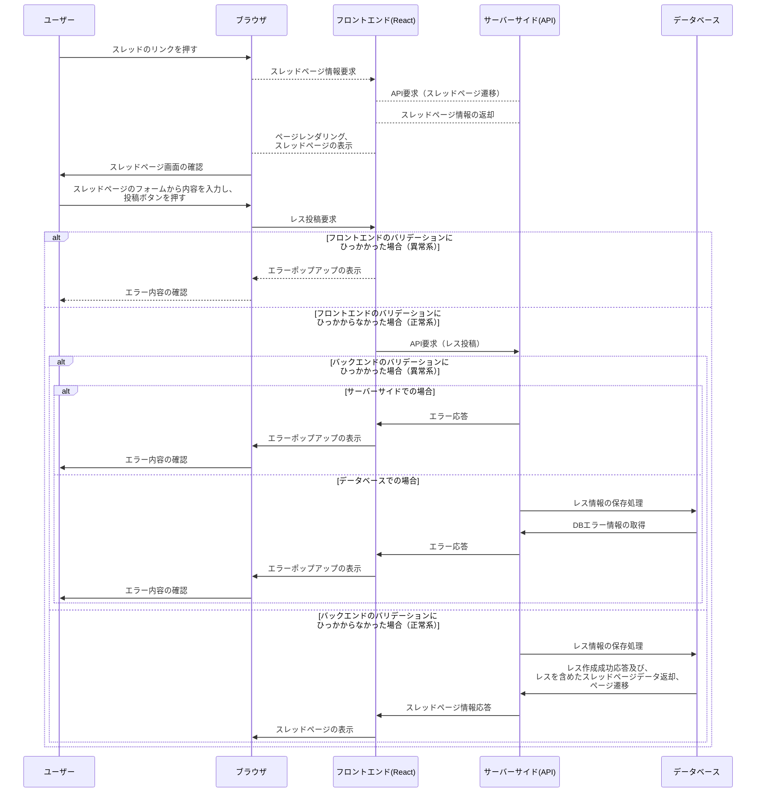
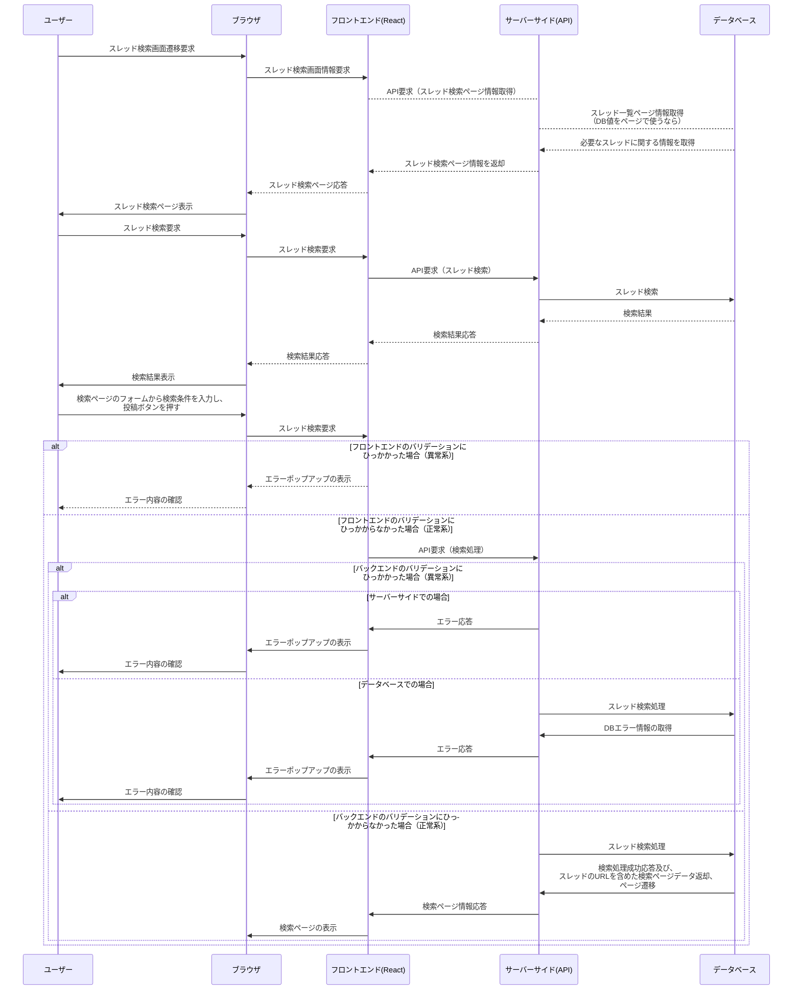
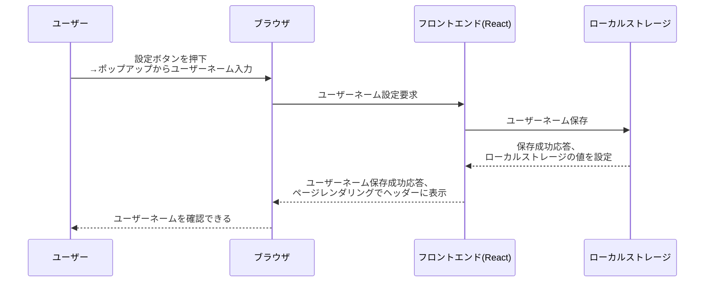

# シーケンス図

## 留意事項

このmarkdownFileは、ChatGPTにモックを作ってもらい、製作者が加筆修正しています。  
もしこれがよろしくないなら…チームで話し合いましょう

```markdown
# 入力したprompt一覧

## 1
あなたは今から掲示板機能を作成する開発者です。これから以下の条件をもとに、markdown形式でシーケンス図を作ってください

【条件】
・成果物はマークダウンファイルである
・ユーザーはログインしないと掲示板を利用できない
・ユーザーは新しいスレッドを作成できる。
・ユーザーはスレッドにメッセージ（返信）を投稿できる。
・ユーザーはスレッドのメッセージを閲覧できる。
・ユーザーは独自のユーザーネームを設定できる。
・ユーザーは既に存在しているスレッドを検索できる。

## 2
先ほどのmarkdownを以下のparticipantで作ってみてください

participant ユーザー
participant ブラウザ
participant フロントエンド(React)
participant サーバーサイド(API)
participant データベース

## 3
独自のユーザーネーム設定機能を、以下のparticipantでマークダウンで記述してください

participant ユーザー
participant ブラウザ
participant フロントエンド(React)
participant ローカルストレージ

```

## ログイン機能


## スレッドの新規作成

## コメント（レス）投稿機能


## スレッド検索機能


## 独自のユーザーネーム設定機能
